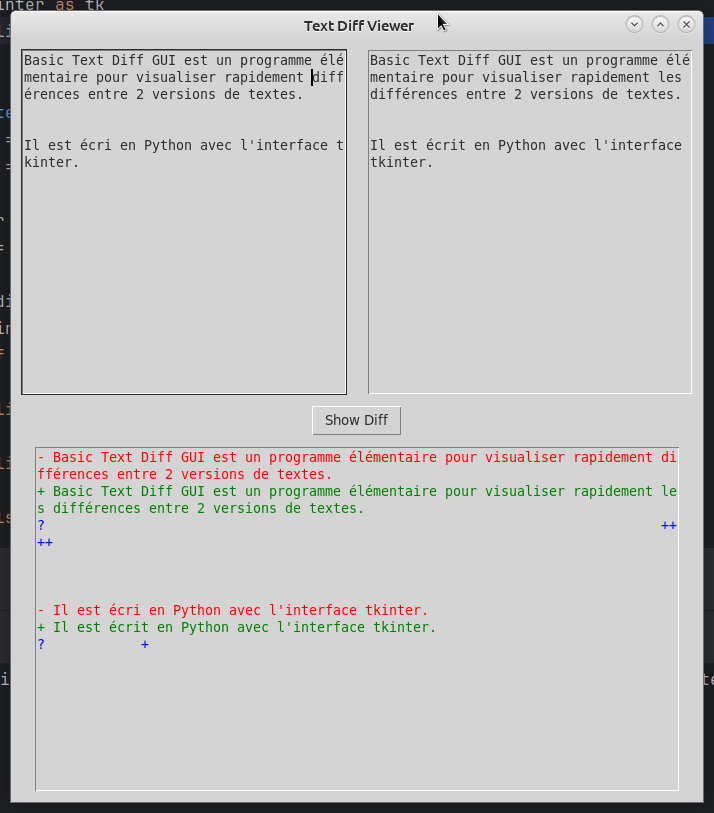

# Py_diff_GUI

Py_diff_GUI is a simple graphical application built using Python's Tkinter library.

It allows users to compare two pieces of text side-by-side and highlights the differences, similar to a diff tool. This tool is useful for comparing documents, code snippets, or any other textual 
content to see what has changed.


## Features

- **Side-by-side text comparison:** Load and display two texts in separate text boxes.
- **Visual Diff Highlighting:** 
  - Lines that are removed (present in the first text but not the second) are highlighted in red.
  - Lines that are added (present in the second text but not the first) are highlighted in green.
  - Lines with changes (indicated by differences in characters) are highlighted in blue.
- **Interactive GUI:** Simple and easy-to-use graphical interface built with Tkinter.

## Screenshots


## Installation
To run the Py_diff_GUI, you'll need Python installed on your system. The program uses the Tkinter and difflib libraries, which are part of the standard Python library.

### Clone the Repository

```bash
git clone https://github.com/bermau/text-diff-viewer.git
cd text-diff-viewer
```

### Run the Application
```python basic_text_diff_gui.py```

## Usage
  1. Enter Texts: Start the application and enter your first text in the left text box and your second text in the right text box.
  1. Show Differences: Click the "Show Diff" button to highlight the differences between the two texts.
  1. Review Differences: The differences will be displayed below, with removed lines in red, added lines in green, and changed lines in blue.

## Author :
Bertrand Maubert, 
Le Puy en Velay, France
## License
This project is licensed under the MIT License - see the LICENSE file for details.

Acknowledgements
  * [Tkinter Documentation](https://docs.python.org/3/library/tkinter.html)
  * [difflib Documentation](https://docs.python.org/3/library/difflib.html)